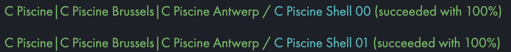
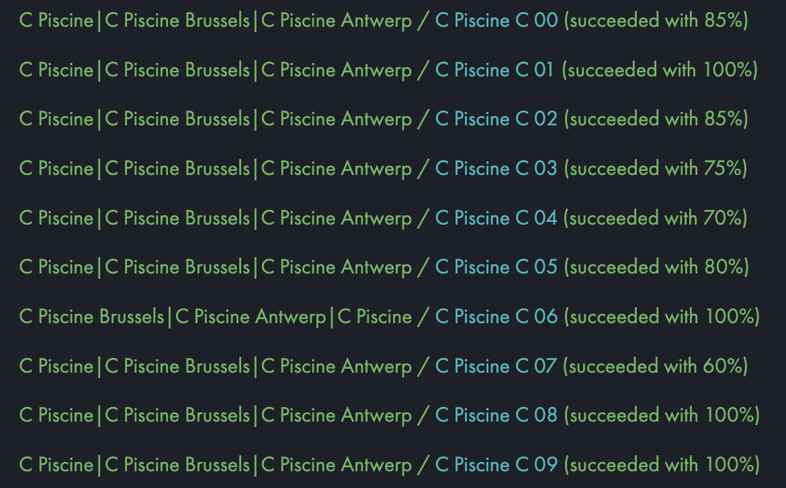
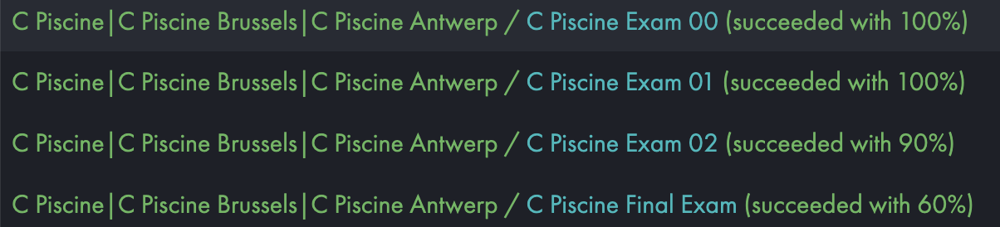

# Pool_42 - 1337 Khoribga

## Overview

Welcome to the **Pool_42 - 1337 Khoribga** repository! This repository contains all the projects and exercises I completed during my time at the **1337 Khoribga** coding pool, which is part of the **42 Network**. The pool is an intensive training program that aims to improve your programming skills, problem-solving abilities, and understanding of computer science fundamentals. Each project is designed to teach key concepts of **C programming** and **algorithm design**.

The **Piscine** (or "pool") is a rigorous and immersive experience, and the work included here spans from the basic introduction to C programming (C00) to more advanced problem-solving and algorithm projects (C09). These projects range from simple exercises like basic variable manipulation and control flow to more complex topics like memory management, recursion, and data structures.

---

## Projects Overview

### **shell00 - shell01**
- **Shell Script**

<p>
  
</p>

### **C00 - C09**

- **C00 - Basics**  
  
- **C01 - Pointers**  
  
- **C02 - C03 Arrays and  String Manipulation**  

- **C04 - Working with Numbers**  
  
- **C05 - Math**  

- **C06 - Args (argc, argv)**  

- **C07 - Memory Management && Dynamic Memory**  
  
- **C08 - Headers File**  
  
- **C09 - Makefile**

<p>
  
</p>

### **Rush00**
- **rush00 - this about drawing in terminal work on team**

<p>
  
</p>

### **Exams (Exam00 to Exam03)**

- **Exam00->100%** 
  
- **Exam01->100%**  
  
- **Exam02->90%**

- **Exam03 or Final_Exam->60%**  

<p>
  
</p>

---

## How to Run the Projects

To run any of the projects from this repository, follow the steps below:

1. Clone the repository:
    ```bash
    git clone https://github.com/oussama-fa/Pool_42.git
    ```

2. Navigate to the project folder:
    ```bash
    cd Pool_42
    ```

3. Compile the C files using `gcc` or your preferred C compiler:
    ```bash
    gcc -o project_name project_name.c
    ```

4. Run the compiled project:
    ```bash
    ./project_name
    ```

Make sure to check each project’s individual folder for specific instructions or dependencies, as some projects may require additional setup (e.g., external libraries).

---

## Technologies Used

- **C Programming Language**  
  All projects are written in C, utilizing standard libraries and system calls.

- **Git**  
  Version control to track progress and manage changes during development.

- **Makefile**  
  Most projects include a `Makefile` to automate compilation and make the building process easier.

---

## Contributing

While this repository represents my personal projects during the **1337 Khouribga** pool, you are welcome to explore and learn from the code. If you find improvements or fixes, feel free to fork the repository and create a pull request.

---

## Contact

For any questions or collaborations, feel free to reach out:

- [Instagram](https://www.instagram.com/oussama._.farah/)
- Email: oussama05farah@gmail.com

---

## License

This project is licensed under the MIT License - see the [LICENSE](LICENSE) file for details.

---

## Acknowledgements

A big thank you to the **42 Network**, the **1337 Khouribga** pool, my peers, and mentors for providing the resources, challenges, and community to learn and grow as a developer.
